# MCM EOS System Flow

## Overview

MCM EOS has three major runtime flows:

1. User authentication and permission loading
2. Operational data entry and CRUD
3. Leadership reporting and cached aggregation

The active runtime is `webapp-restart/server.js`, which serves the frontend and API from one Express app.

## Request Flow

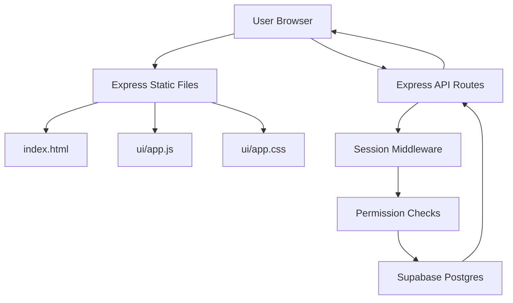

## Login Flow

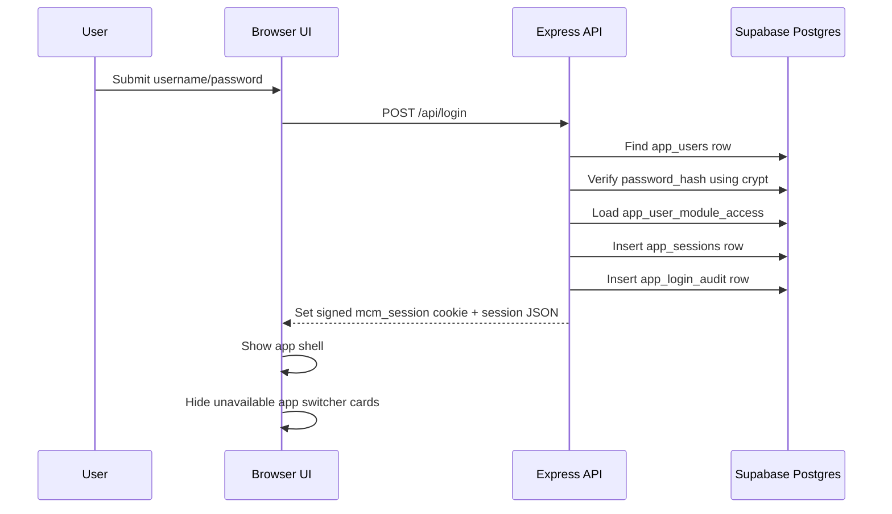

## Authenticated API Flow

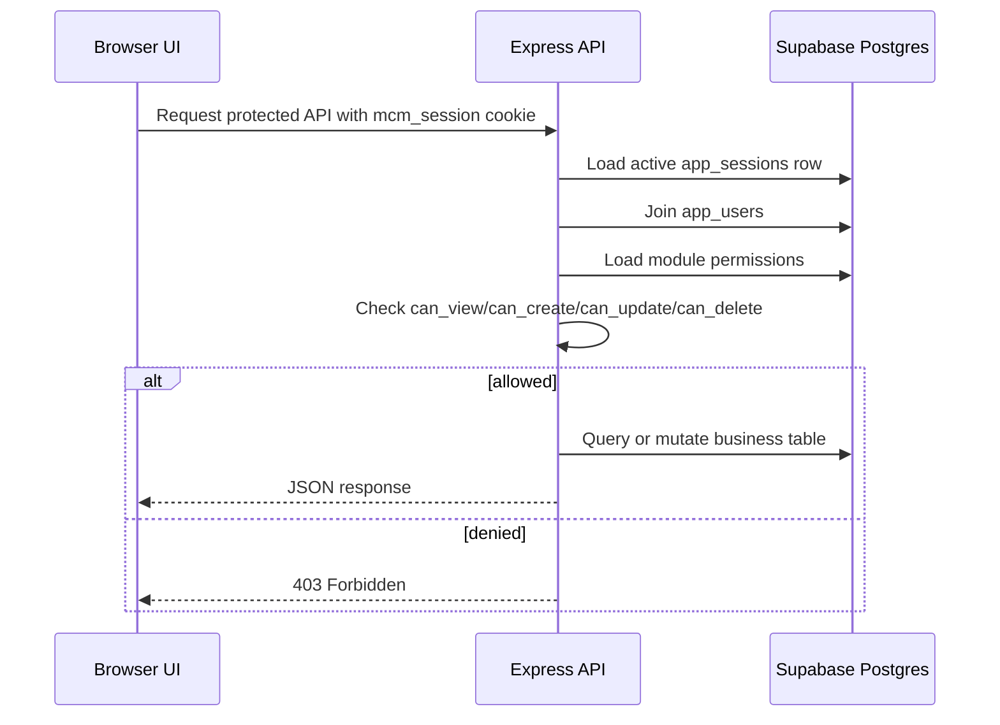

## Frontend Navigation Flow

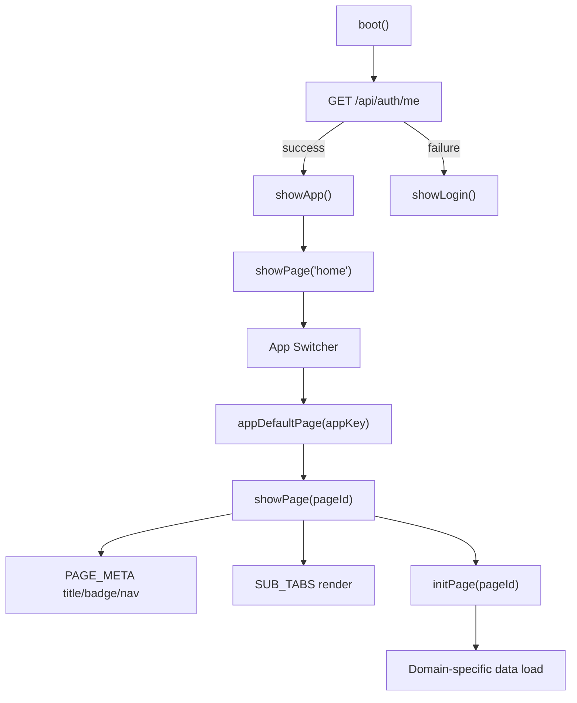

## Operational CRUD Flow

The operational modules follow a common pattern:

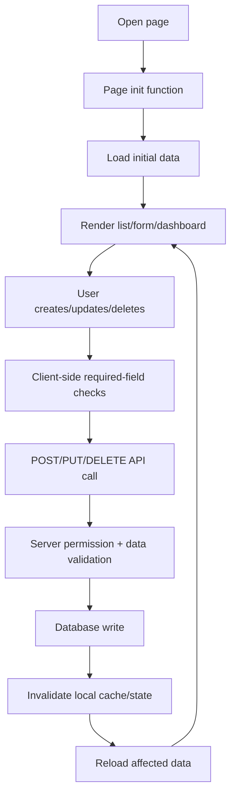

## Sales Entry Flow

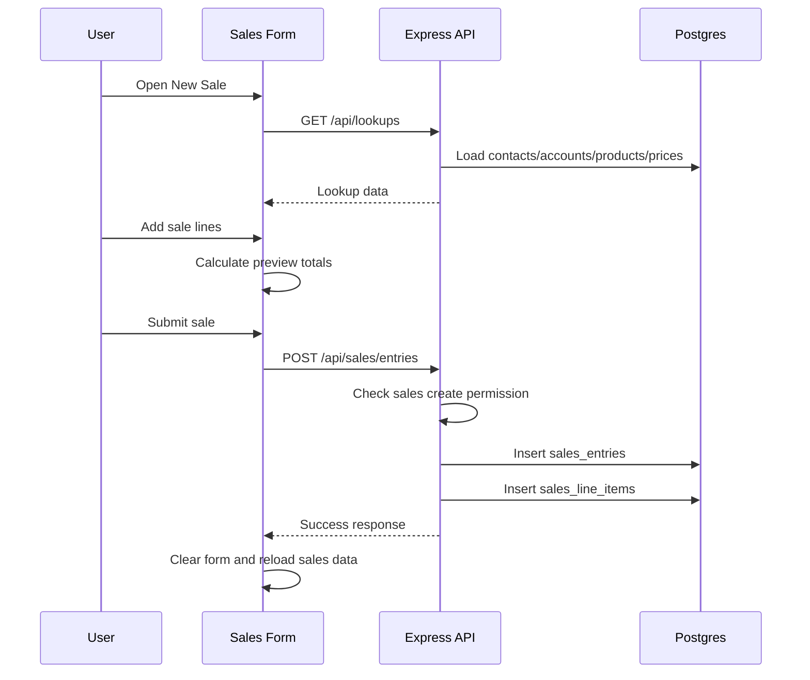

## Material Purchase Flow

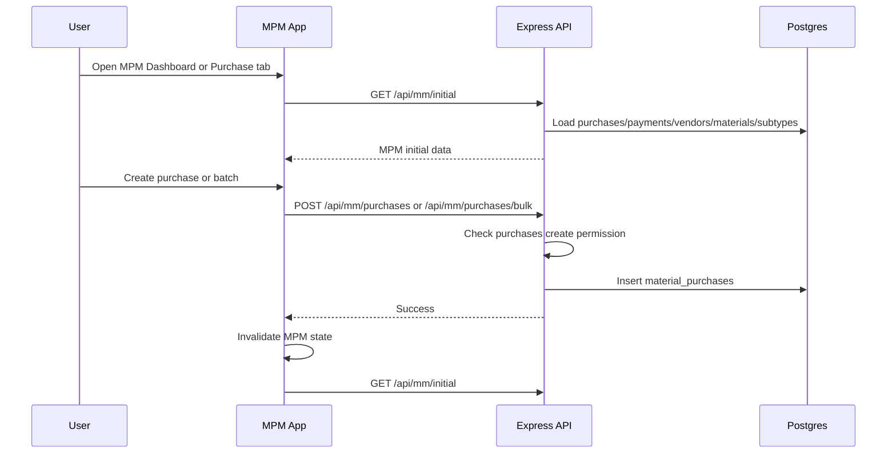

## Vendor Payment Flow

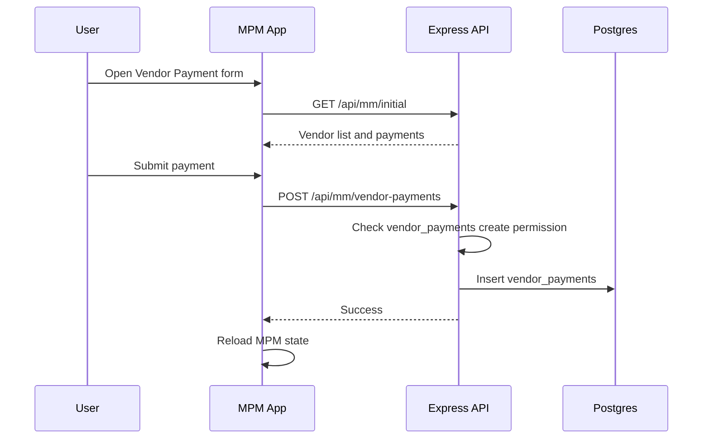

## Production Flow

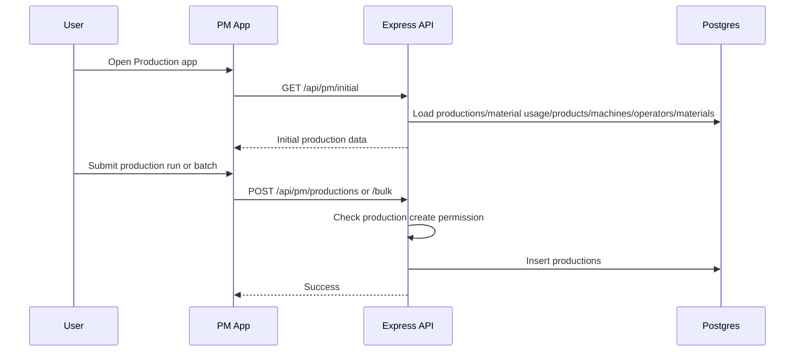

## Leadership Report Flow

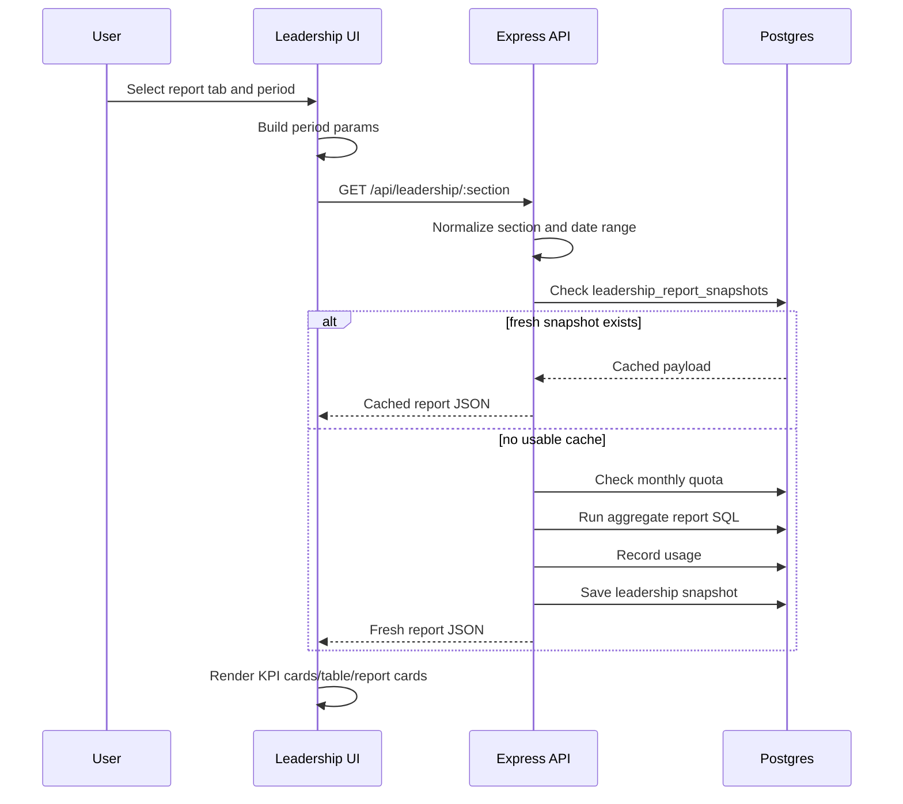

## Leadership Material Purchased Flow

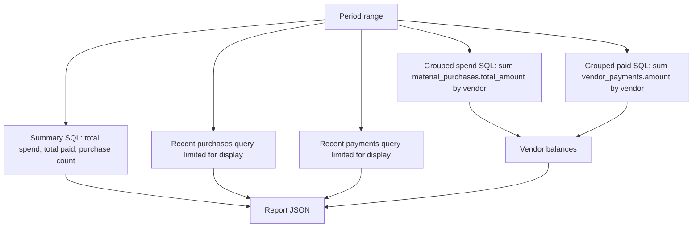

Important distinction: recent purchases are display rows only. Spend by vendor must come from the grouped SQL aggregate over all matching purchases.

## Deployment Flow

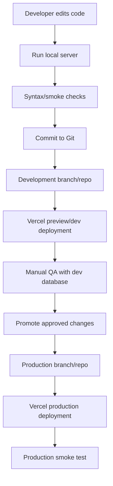

## Error Flow

Common errors:

- `401` when no valid session exists
- `403` when permission is missing
- `400` when required form data is invalid
- `429` when Leadership quota is exhausted
- `500` for unhandled server/database errors

The frontend generally shows errors through toast messages or inline empty-state cards.

## Cache Flow

Frontend caches:

- page loaded-state set
- domain arrays such as `MM`, `MDM`, admin product/pricing data
- Leadership in-memory cache by section and period

Server caches:

- Leadership report snapshots in Postgres

Cache invalidation examples:

- Material purchase write calls `invalidateMM()`
- Material master write calls `invalidateMDM()`
- Product/pricing changes clear lookup cache
- Leadership period changes clear frontend Leadership cache
- Leadership cache version changes invalidate old server snapshots

